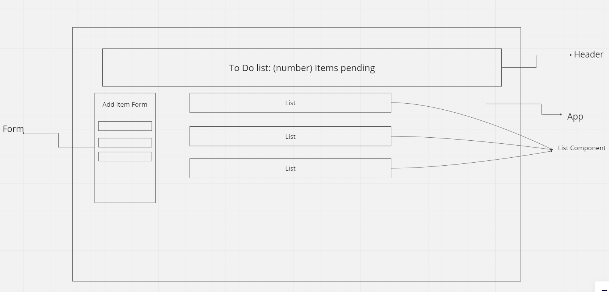
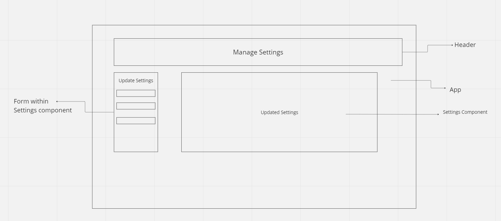

# LAB - Class 31/ Class 32

## Project: todo-app

### Author: Jordan Covington

### Problem Domain  

Phase 1

1. Implement the React context API for defining settings across the entire application.
    - Create React Context for managing application display settings and provide this at the application level.
    - Add the following defaults to the context provider’s state, they will not be changeable in this lab.
      - Display three items.
      - Hide completed items using a boolean.
      - Define “difficulty” as a default sort word to optionally use in the stretch goal.

2. Consume and utilize context values throughout your components.
    - Show a maximum of three items per screen by default in the `<List />` component.
   - Use the Mantine `<Pagination />` component to allow users to navigate a list of items.
    - Hide completed items in the list by default (the ability to show will be added in a later lab).

3. Pagination Notes:

    - Only display the first n items in the list, where n is the default number three from your settings context.
    - If you have more than n items in the list, the `<Pagination />` component will add a button that, when clicked, will replace the list with the next n. items in the list.
    - the `<Pagination />` component will manage the “previous” and “next” buttons upon correct implementation.

Phase 2

1. Extend your `context` provider to include all of the following features:
    - Create a `context` for managing application settings and provide this at the application level.
    - Display or Hide completed items (boolean).
    - Number of items to display per screen (number).
    - Default sort field (string).
    - Create a function in your context that saves user preferences (for the above) to local storage.
    - Implement a `useEffect()` (or `componentDidMount()`) in your context to read from local storage and set the values for those 2 state properties on application load.
        - Note: You will need to `stringify()` your state prior to saving to local storage, and parse it when you retrieve it.

2. Consume and utilize `Context` values throughout your components:
    - Show a maximum of a certain number of items per screen in the `<List />` component.
        - Properly implement the Mantine `<Pagination />` component functionality to let the users navigate a long list of items with the correct number of tasks showing per “page”.
    - Hide or show completed items in the list.

### Links and Resources

- [GitHub Repo](https://github.com/JMCov/todo-app)
- [Lab 31 - CodeSandbox](https://codesandbox.io/p/github/JMCov/todo-app/context-settings?file=%2FREADME.md&workspace=%257B%2522activeFileId%2522%253A%2522clfsrdont000wg0eq9xangkav%2522%252C%2522openFiles%2522%253A%255B%255D%252C%2522sidebarPanel%2522%253A%2522EXPLORER%2522%252C%2522gitSidebarPanel%2522%253A%2522COMMIT%2522%252C%2522spaces%2522%253A%257B%2522clfsremb500cz356l707xixgb%2522%253A%257B%2522key%2522%253A%2522clfsremb500cz356l707xixgb%2522%252C%2522name%2522%253A%2522Default%2522%252C%2522devtools%2522%253A%255B%257B%2522key%2522%253A%2522clfsremb600d0356l6vdjk7ac%2522%252C%2522type%2522%253A%2522PROJECT_SETUP%2522%252C%2522isMinimized%2522%253Afalse%257D%252C%257B%2522type%2522%253A%2522PREVIEW%2522%252C%2522taskId%2522%253A%2522start%2522%252C%2522port%2522%253A3000%252C%2522key%2522%253A%2522clfsremb600d1356luoq24wjc%2522%252C%2522isMinimized%2522%253Afalse%257D%255D%257D%257D%252C%2522currentSpace%2522%253A%2522clfsremb500cz356l707xixgb%2522%252C%2522spacesOrder%2522%253A%255B%2522clfsremb500cz356l707xixgb%2522%255D%252C%2522hideCodeEditor%2522%253Afalse%257D)
- [Lab 32 - CodeSandbox](https://codesandbox.io/p/github/JMCov/todo-app/context-methods?file=%2FREADME.md&workspace=%257B%2522activeFileId%2522%253A%2522clfsrdont000wg0eq9xangkav%2522%252C%2522openFiles%2522%253A%255B%255D%252C%2522sidebarPanel%2522%253A%2522EXPLORER%2522%252C%2522gitSidebarPanel%2522%253A%2522COMMIT%2522%252C%2522spaces%2522%253A%257B%2522clft802yr007t356lk7n7466s%2522%253A%257B%2522key%2522%253A%2522clft802yr007t356lk7n7466s%2522%252C%2522name%2522%253A%2522Default%2522%252C%2522devtools%2522%253A%255B%257B%2522key%2522%253A%2522clft8fmnp006l356lf3gm3m4w%2522%252C%2522type%2522%253A%2522PROJECT_SETUP%2522%252C%2522isMinimized%2522%253Afalse%257D%252C%257B%2522type%2522%253A%2522TASK_LOG%2522%252C%2522taskId%2522%253A%2522start%2522%252C%2522key%2522%253A%2522clft8097000el356lnc5jzcxe%2522%252C%2522isMinimized%2522%253Afalse%257D%252C%257B%2522type%2522%253A%2522PREVIEW%2522%252C%2522taskId%2522%253A%2522start%2522%252C%2522port%2522%253A3000%252C%2522key%2522%253A%2522clft8093500cz356l0ahdrz1x%2522%252C%2522isMinimized%2522%253Afalse%252C%2522path%2522%253A%2522%252F%2522%257D%255D%257D%257D%252C%2522currentSpace%2522%253A%2522clft802yr007t356lk7n7466s%2522%252C%2522spacesOrder%2522%253A%255B%2522clft802yr007t356lk7n7466s%2522%255D%252C%2522hideCodeEditor%2522%253Afalse%257D)

### Setup

#### How to initialize/run your application (where applicable)

npm start

#### How to use your library (where applicable)

#### UML

